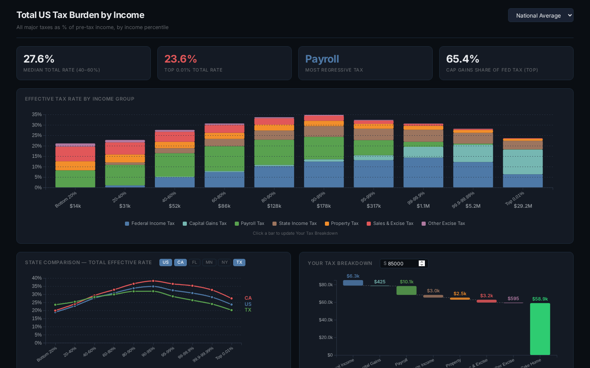

# Tax Explorer



**Live app → [tax-explorer-app.web.app](https://tax-explorer-app.web.app)**

An interactive dashboard visualizing the total US tax burden across income levels — federal income, capital gains, payroll, state income, property, sales & excise taxes — broken down by income percentile and state.

## Features

- **Effective Rate by Income Group** — Stacked bar chart showing all major taxes as a % of pre-tax income across 10 income percentile buckets (Bottom 20% → Top 0.01%)
- **State Comparison** — Line chart comparing total effective tax rates across up to 5 states simultaneously (US, CA, FL, MN, NY, TX)
- **Personal Tax Breakdown** — Enter your income and get a waterfall chart showing exactly how much you pay in each tax category and what you take home
- **Income Composition by Source** — See how income is distributed across wages, business income, capital gains, and other sources at each income level
- **Historical Tax Rates (1950–2022)** — Trend lines showing how effective rates for different income groups have shifted over 70+ years

## Data Sources

- [ITEP "Who Pays?" 7th Edition](https://itep.org/whopays/)
- CBO Distributional Analysis
- IRS Statistics of Income (SOI)
- Social Security Administration (SSA)
- Saez-Zucman distributional estimates

## Tech Stack

| | |
|---|---|
| **Framework** | React 19 + TypeScript |
| **Build Tool** | Vite |
| **Charts** | D3.js (custom SVG) |
| **Hosting** | Firebase Hosting |
| **Testing** | Vitest |

## Getting Started

```bash
# Install dependencies
npm install

# Start dev server
npm run dev

# Run tests
npm test

# Build for production
npm run build
```

## Project Structure

```
src/
├── components/
│   ├── TaxChart.tsx           # Main stacked bar chart
│   ├── EffectiveRateChart.tsx # State comparison line chart
│   ├── WaterfallChart.tsx     # Personal income waterfall
│   ├── HistoricalChart.tsx    # 1950–2022 historical trends
│   ├── IncomeCompositionChart.tsx
│   ├── Legend.tsx
│   └── Tooltip.tsx
└── data/
    ├── taxData.ts             # Tax rates by state & income bucket
    ├── incomeComposition.ts   # Income source breakdowns
    ├── historicalData.ts      # Historical effective rate data
    └── types.ts
```
